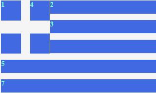

#Greece Flag
Project cloned from ChengYen-Lu's github repo @ https://github.com/ChengYen-Lu/kindagreekflag

numbered boxes have divs while unnumbered ones are shadow boxes of those above them.

## TODO
- Currently, box-2 and box-3 are floating to the right plus there's a gap between box-4 and box-2. 
